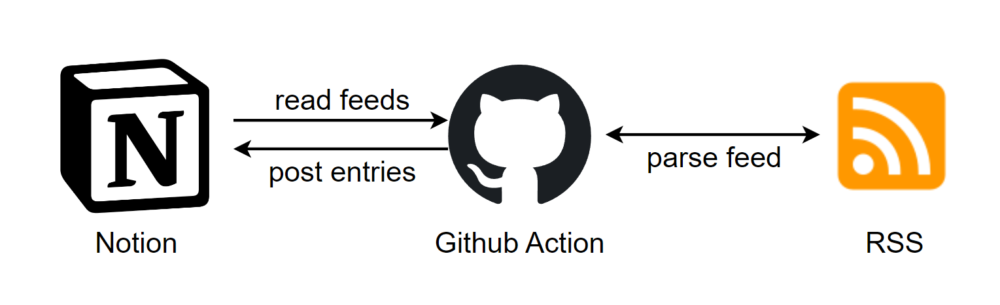

# RSS-to-Notion

将RSS源导入Notion进行整理，提供URL进行阅读，并且利用Github Action自动更新RSS内容

支持[简悦](https://github.com/Kenshin/simpread)使用同一数据库，更好管理阅读源

## Features

- 在Notion数据库中管理RSS源
- 利用Notion管理RSS Entries（例如关键词、文章信息、标签等）
- 定时更新

## Acknowledgement

- https://github.com/Key033/RSS2Notion
- https://github.com/rainyear/dailybot